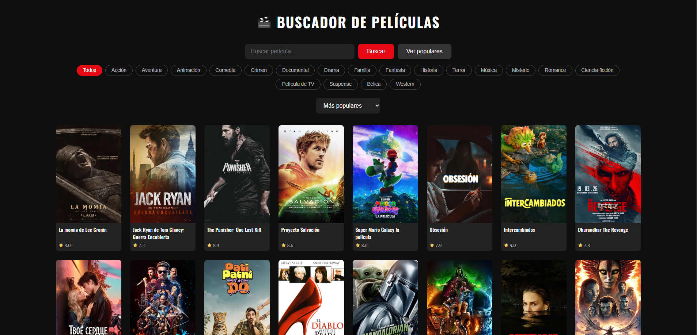
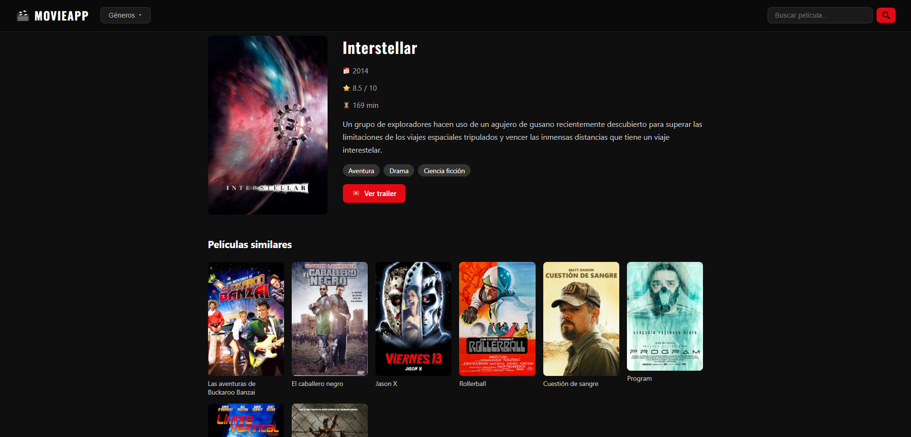

# 🎬 Movie Finder

Aplicación web para descubrir y explorar películas usando la API de TMDB. Construida con Next.js 16 y desplegada en Vercel.

> ⚠️ **Proyecto educativo** — desarrollado para aprender desarrollo web fullstack con Next.js, React y APIs externas. No está pensado para uso en producción.

🔗 **Demo en vivo:** [movie-finder-farra.vercel.app](https://movie-finder-farra.vercel.app)

---

## Capturas de pantalla




---

## Tecnologías

- [Next.js 16](https://nextjs.org/) — framework fullstack con App Router y Server Components
- [React 19](https://react.dev/) — librería de interfaces de usuario
- [TMDB API](https://www.themoviedb.org/) — datos de películas
- CSS Modules — estilos con alcance local por componente
- [Vercel](https://vercel.com/) — deploy y hosting

---

## Funcionalidades

- Listado de películas populares cargadas en el servidor (Server Components)
- Navbar con aparición al hacer scroll e integración con filtro de géneros
- Buscador por título con soporte para búsqueda desde la URL (`?q=`)
- Filtrado por género mediante chips interactivos y menú desplegable en el navbar
- Ordenación por popularidad, puntuación o año
- Paginación con "Ver más" y auto-relleno de filas incompletas
- Deduplicación de películas para evitar repeticiones al paginar
- Página de detalle con sinopsis, duración, géneros y puntuación
- Enlace al trailer oficial en YouTube
- Películas similares en la página de detalle
- Loading state en la página de detalle
- Contexto global para compartir el género seleccionado entre componentes
- Footer con créditos de datos e iconos

---

## Estructura del proyecto

```
app/
├── components/
│   ├── Navbar.js / Navbar.module.css
│   ├── MovieList.js / MovieList.module.css
│   └── Footer.js / Footer.module.css
├── context/
│   └── GenreContext.js
├── pelicula/
│   └── [id]/
│       ├── page.js
│       ├── page.module.css
│       ├── loading.js
│       └── loading.module.css
├── page.js
├── page.module.css
├── layout.js
└── globals.css
public/
└── icons/
```

---

## Ejecutar en local

### Requisitos

- Node.js 18 o superior
- Cuenta en [TMDB](https://www.themoviedb.org/) para obtener una API key gratuita

### Pasos

1. Clona el repositorio:

```bash
git clone https://github.com/tu-usuario/movie-finder.git
cd movie-finder
```

2. Instala las dependencias:

```bash
npm install
```

3. Crea el archivo `.env.local` en la raíz del proyecto:

```
NEXT_PUBLIC_TMDB_API_KEY=tu_api_key
```

4. Arranca el servidor de desarrollo:

```bash
npm run dev
```

5. Abre [http://localhost:3000](http://localhost:3000) en el navegador.

---

## Autor

Pau Montes Mondéjar — [GitHub](https://github.com/paumonts04) · [LinkedIn](https://www.linkedin.com/in/pau-montes-mondéjar-18914a408/)

---

*Datos proporcionados por [TMDB](https://www.themoviedb.org/). Iconos por varios autores vía [icon-icons.com](https://icon-icons.com) — [CC BY 4.0](https://creativecommons.org/licenses/by/4.0/)*
